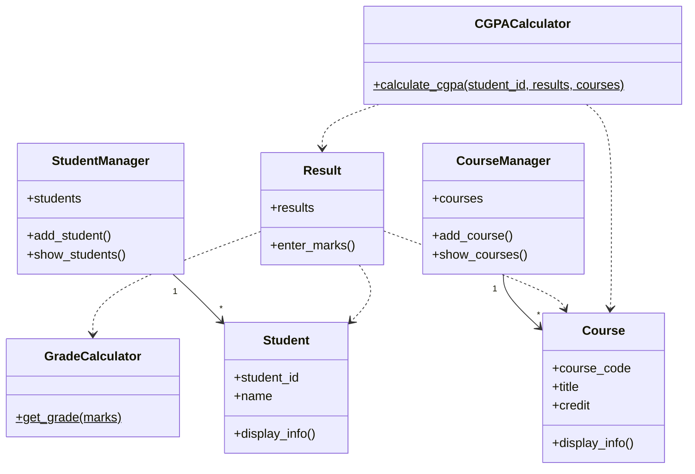

# Student Result Manager
## UML Class Diagram

```mermaid
classDiagram
    class Student {
        +student_id
        +name
        +display_info()
    }

    class StudentManager {
        +students
        +add_student()
        +show_students()
    }

    class Course {
        +course_code
        +title
        +credit
        +display_info()
    }

    class CourseManager {
        +courses
        +add_course()
        +show_courses()
    }

    class GradeCalculator {
        +get_grade(marks)$
    }

    class Result {
        +results
        +enter_marks()
    }

    class CGPACalculator {
        +calculate_cgpa(student_id, results, courses)$
    }

    StudentManager "1" --> "*" Student
    CourseManager "1" --> "*" Course
    Result ..> GradeCalculator
    Result ..> Student
    Result ..> Course
    CGPACalculator ..> Result
    CGPACalculator ..> Course
```
